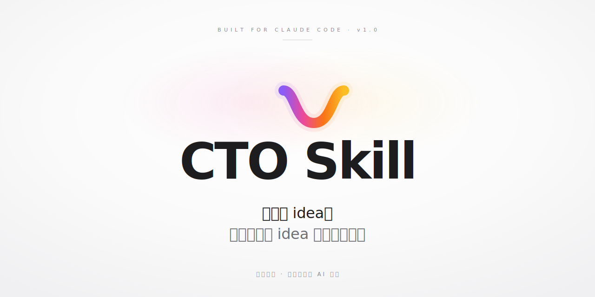

<div align="center">



<br/>

[](https://github.com/yzfly/CTO-Skills/releases/latest)
[](https://creativecommons.org/licenses/by-nc/4.0/)
[](https://claude.ai/code)
[](https://github.com/yzfly/CTO-Skills)

**不填表 · 不写 PRD · 不画架构图**

</div>

---

## AI 写代码已经不是瓶颈了。想不清楚才是。

你打开 Claude Code，给它一句「帮我做个发票工具」，它给你 800 行代码。

跑起来一看——少了客户管理、没有催款、付款流程不通、数据模型乱、加新功能就崩。返工。再返工。

不是 AI 不够聪明。是**你没把想法想清楚，AI 就开干了**。

从「我想做个发票工具」到「Vue + FastAPI + PostgreSQL，RSC 优先，催款走 Celery，错误信封统一 RFC 7807」——中间隔着十年工程经验。

**这十年，CTO Skill 帮你压缩到一场对话。**

---

## 30 秒看效果

```
你:    我想做一个发票工具，给自由职业者用。

CTO:   做发票的人最痛的不是开票，是收款。你想先解决哪一头？

你:    收款。客户老忘付。

CTO:   懂了。核心是"自动催款"。下一个关键决定：
       客户必须注册才能付，还是发个链接他点开就能付？

你:    不注册，越简单越好。

CTO:   好，定了——无登录付款。这意味着我们走 Stripe Payment Links
       而不是自建支付页，省你 80% 工作量。下一个问题：催款用邮件还
       是短信？...

[20 轮自然对话后]

CTO:   差不多了。要看一下整理好的设计方案吗？

→ brief.md + arch.md + specs/features/*.md + 完整 references 库
  直接喂给 Claude Code / Cursor / Codex 开工
```

---

## 它不是什么

- **不是代码生成器** —— 它只设计，不写代码
- **不是 PRD 模板** —— 你不是在填表，是在和一个会思考的人对话
- **不是问答机器人** —— 它会反推你没说的，会在关键岔路口让你拍板，会在你说错的地方推你一下

它是**装在你 Claude Code 里的一个会思考的技术合伙人**。

---

## 谁该装这个 skill

✅ **你是这种人**
- 有想法，不想从零写 PRD / 架构图
- 在 Claude Code / Cursor / Codex 里写过几次代码，知道 AI agent 能干活
- 但缺「先想清楚再让它干」的那一步
- 懂或不懂技术都行——CTO 会用业务语言跟你聊

❌ **不要装，浪费你时间**
- 已经有完整代码库，只想加个功能 → 直接告诉 coding agent，不需要 CTO
- 想要个 PRD 填空模板 → 去搜 Notion 模板，更快
- 想要 AI 替你做决定 → CTO 会帮你想，但最后拍板的人是你
- 已经能脱口而出"单体 vs 微服务"、"CQRS"、"event sourcing" → 这个 skill 不是给你的

---

## 30 秒装好

### 方式 A — 下载 .skill 包（最快，无需 git）

```bash
curl -L -o cto.skill https://github.com/yzfly/CTO-Skills/releases/latest/download/cto.skill
unzip cto.skill -d ~/.claude/skills/
```

### 方式 B — 克隆仓库（方便更新）

```bash
git clone https://github.com/yzfly/CTO-Skills.git
cp -r CTO-Skills/skills/cto ~/.claude/skills/
```

### 方式 C — 项目级安装

```bash
cp -r CTO-Skills/skills/cto .claude/skills/
```

装完，在 Claude Code 里输入：

> 我想做一个 ...
>
> I want to build ...

CTO 自动接管。

以后要更新 CTO Skill，直接在 Claude Code 里说「更新 CTO Skill」即可；skill 内置了自更新说明，会引导 Claude Code 从这个仓库同步最新版本。

---

## 它内置的三层认知架构

让它真的像一个 CTO，不是台词机器人。

### 第一层 · 工作记忆（CTO 思考时调用）

- **10 个行业的反射弧** —— 做发票工具？做内容平台？做 SaaS？CTO 自动调用对应的"应该问什么"
- **15 个核心架构矛盾的判断框架** —— 一致性 vs 可用性 / 同步 vs 异步 / 单体 vs 微服务 ...
- **brief / arch / specs 三种产物的 schema 模板**
- **桥接层** —— 决定打包什么编码规范给下游 coding agent

### 第二层 · 顾问团（10 位传奇 CTO 的决策内核）

关键决策点，CTO 会按场景调对应人格做"压力测试"：

| 决策场景 | 调用谁 | 视角 |
|---------|-------|------|
| 单体 vs 微服务 | DHH + Martin Fowler | "你真的需要拆吗？" |
| 分布式系统设计 | Werner Vogels + Jeff Dean | "失败模式想清楚了吗？" |
| API 设计 | Patrick Collison（Stripe） | "向后兼容是不可侵犯的契约" |
| AI 应用 | Andrej Karpathy | "该用 AI 还是传统代码？有 eval 吗？" |
| 高可靠性 | Charity Majors | "看不见就不存在" |
| 数据模型 | Linus Torvalds | "数据结构选对了吗？" |
| 平台 / 团队规模化 | Will Larson | "工程问题就是组织问题" |
| 简化 vs 抽象 | Kelsey Hightower | "No code is the best code" |

完整 10 位 + 场景索引 + 人格冲突表见 [`personas/README.md`](skills/cto/references/personas/README.md)。

### 第三层 · 全栈编码参考库（3.7MB）

CTO 设计完，**按你选的 stack 自动打包对应子集**，跟着 brief/arch/specs 一起交给下游 coding agent：

| 类别 | 内容 |
|------|------|
| 编码规范 | Python · Go · JS · TS · Rust · SQL（Google / Uber / Airbnb / 官方） |
| 前端 | React+Next.js（Vercel 45 rules）· Vue+Nuxt |
| 后端 | Go（samber 42 skills）· Python+FastAPI |
| 设计 | Microsoft REST API · PostgreSQL · Google DESIGN.md |
| 评审 | Google eng-practices |
| 安全 | 13 类 SAST 漏洞检测 |
| 方法论 | TDD · CI/CD · 调试 · 发布 等 17 种 |

下游 coding agent 不用自己找资料——CTO 直接把"该读什么、什么时候读、为什么读"全配齐。

---

## 为什么我做这个

我用 Claude Code / Cursor 写了不少东西。

最痛的不是「AI 不够聪明」，是**我没把想法想清楚，AI 就开干了**。  
返工。返工。再返工。

我浪费了几百个小时在「方向错了」这件事上。直到我意识到——

**AI 时代缺的不是 coding agent，是站在 coding agent 前面的那个「想清楚的人」。**  
真实世界里，这个人叫 CTO。

CTO Skill 是把那个人，装进你的 Claude Code。

—— 云中江树

---

## 致谢

本项目站在巨人的肩膀上，整合了以下优秀的开源项目和权威资源：

### 编码规范

| 资源 | 来源 | Stars | 许可 |
|------|------|-------|------|
| [Google Python Style Guide](https://github.com/google/styleguide) | Google | 39K+ | Apache-2.0 |
| [Google TypeScript Style Guide](https://github.com/google/styleguide) | Google | 39K+ | Apache-2.0 |
| [Airbnb JavaScript Style Guide](https://github.com/airbnb/javascript) | Airbnb | 148K+ | MIT |
| [Uber Go Style Guide](https://github.com/uber-go/guide) | Uber | 17K+ | Apache-2.0 |
| [Rust API Guidelines](https://github.com/rust-lang/api-guidelines) | Rust 官方 | 1.3K+ | MIT / Apache-2.0 |
| [SQL Style Guide](https://github.com/treffynnon/sqlstyle.guide) | Simon Holywell | 1.5K+ | CC-BY-SA-4.0 |

### 前端

| 资源 | 来源 | Stars | 许可 |
|------|------|-------|------|
| [React Best Practices](https://github.com/vercel) | Vercel Engineering | - | MIT |
| [Vue.js Style Guide](https://github.com/vuejs/docs) | Vue.js 官方 | - | MIT |
| [Nuxt Best Practices](https://github.com/onmax/nuxt-skill-hub) | onmax | 41+ | - |

### 后端

| 资源 | 来源 | Stars | 许可 |
|------|------|-------|------|
| [Go Skills (42 skills)](https://github.com/samber/cc-skills-golang) | samber | 1.5K+ | MIT |
| [FastAPI Best Practices](https://github.com/zhanymkanov/fastapi-best-practices) | zhanymkanov | 17K+ | MIT |

### 设计

| 资源 | 来源 | Stars | 许可 |
|------|------|-------|------|
| [Microsoft REST API Guidelines](https://github.com/microsoft/api-guidelines) | Microsoft | 23K+ | CC-BY-4.0 |
| [DESIGN.md Specification](https://github.com/google-labs-code/design.md) | Google Labs | 11K+ | Apache-2.0 |
| [Database Schema Designer](https://github.com/borghei/Claude-Skills) | borghei | 104+ | - |
| [PostgreSQL Guide](https://github.com/simplyblock/vela-skill) | simplyblock | 2+ | MIT |
| [SQL Schema Generator](https://github.com/majiayu000/claude-skill-registry) | majiayu000 | 261+ | MIT |
| [PostgreSQL "Don't Do This"](https://wiki.postgresql.org/wiki/Don%27t_Do_This) | PostgreSQL Wiki | - | CC-BY |

### 评审

| 资源 | 来源 | Stars | 许可 |
|------|------|-------|------|
| [Google Engineering Practices](https://github.com/google/eng-practices) | Google | 20K+ | CC-BY-3.0 |

### 安全

| 资源 | 来源 | Stars | 许可 |
|------|------|-------|------|
| [SAST Skills](https://github.com/utkusen/sast-skills) | utkusen | 633+ | MIT |

### 工程方法论

| 资源 | 来源 | Stars | 许可 |
|------|------|-------|------|
| [Agent Skills](https://github.com/addyosmani/agent-skills) | Addy Osmani | 27K+ | MIT |
| [AGENT-ZERO](https://github.com/msitarzewski/AGENT-ZERO) | msitarzewski | 200+ | Unlicense |

## 许可

原创内容（SKILL.md、CTO Hub 人格文件、桥接层文件）采用 [CC BY-NC 4.0](https://creativecommons.org/licenses/by-nc/4.0/) 许可。

引用的第三方内容保持各自原始许可（见上方致谢）。商用前请各自确认。

## 作者

**云中江树** · 微信公众号：云中江树

> 关注公众号，看更多 AI Agent 工程实践

---

<div align="center">

**如果这个 skill 帮到你，给个 ⭐ 是最直接的支持。**

</div>
